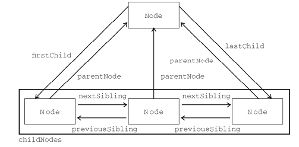

#JavaScript 高级程序设计

## DOM

>DOM(文档对象模型)是针对HTML和XML文档的一个API。DOM描绘了一个层次化的节点树，允许开发人员添加、移除和修改页面的某一部分。DOM脱胎于Netscape及微软创始的DHTML，但是现在它已经成为表现和操作页面标记的跨平台、语言中立的方式。

*IE中的所有DOM对象都是以COM对象的形式实现的*

### 节点层次

>DOM可以将任何HTML或XML文档描绘成一个由多层节点构成的结构。节点分为几种不同的类
型，每种类型分别表示文档中不同的信息及（或）标记。每个节点都拥有各自的特点、数据和方法，另外也与其他节点存在某种关系。

简单的HTML文档

```html
<!DOCTYPE html>
<html>
<head>
    <title>sample page</title>
</head>
<body>
    <p>hello world!</p>
</body>
</html>
```

可以展开为层次结构


#### Node类型

>DOM1 级定义了一个Node接口，该接口将由DOM 中的所有节点类型实现。这个Node 接口在JavaScript中是作为Node类型实现的；`除了IE之外`，在其他所有浏览器中都可以访问到这个类型。JavaScript 中的所有节点类型都继承自Node类型，因此所有节点类型都共享着相同的基本属性和方法。

**nodeType**

每个节点都有一个`nodeType`属性，用于表明节点类。节点类型由在Node类型中定义的12个数值常量来表示

1. Node.ELEMENT_NODE(1)；

2. Node.ATTRIBUTE_NODE(2)；

3. Node.TEXT_NODE(3)；

4. Node.CDATA_SECTION_NODE(4)；

5. Node.ENTITY_REFERENCE_NODE(5)；

6. Node.ENTITY_NODE(6)；

7. Node.PROCESSING_INSTRUCTION_NODE(7)；

8. Node.COMMENT_NODE(8)；

9. Node.DOCUMENT_NODE(9)；

10. Node.DOCUMENT_TYPE_NODE(10)；

11. Node.DOCUMENT_FRAGMENT_NODE(11)；

12. Node.NOTATION_NODE(12)。

*由于IE没有公开Node类型的构造函数，因此，最好还是将nodeType属性与数字值进行比较*

```javascript
if(someNode.nodeType == 1){ //适用于所有浏览器
    console.log('Node is an element');
}
```

**nodeName & nodeValue**

可以了解节点的具体信息，这两个属性的值完全取决于节点的类型

```javascript
//先检测一下节点的类型
if(someNode.nodeType == 1){
    value = someNode.nodeName; //nodeName的值是元素的标签名
}
```

**节点关系**

文档中所有的节点之间都存在这样或那样的关系。节点间的各种关系可以用传统的家族关系来描述，相当于把文档树比喻成家谱。



节点的关系属性

1. childNodes [返回NodeList/null]
    1. firstChild
    2. lastChild
2. parentNode 
3. previousSibling [返回NodeList/null]
4. nextSibling [返回NodeList/null]
5. ownerDocument [document]

**NodeList**

NodeList是一种类数组对象，用于保存一组有序的节点。它的独特指出在于，它实际上是`基于DOM结构动态执行查询的结果`，因此DOM结构的变化能够自动反映在NodeList对象中。

*下列这段代码能够加深对NodeList的认识，运行在浏览器可能会导致死机*

```javascript
    var alldivs=document.getElementsByTagName("div");
    for(var i=0;i<alldivs.length;i++){ //死循环，alldivs.length不断增加
        console.log(alldivs.length);
        document.body.appendChild(document.createElement("div"));
    }
```

通常出于性能和操作方面的考虑，会将NodeList转化为数组

```javascript
/*
    由于IE8及更早版本将NodeList实现为一个COM对象，因此只能手动枚举所有成员。
    其他的版本或其他浏览器，则使用Array.prototype.slice进行转换就可以
*/
function convertToArray(nodes){
    var array = null;
    try{
        array = [].prototype.slice.call(nodes,0);
    } catch (ex){
        array = [];
        for (var i = 0,len = nodes.length;i++){
            array.push(nodes[i]);
        }
    }

    return array;
}
```

**操作节点**

以下四个方法，在`不支持子节点`的节点上调用，将会导致错误发生

1. appendChild(childNode)
    
    用于向childNodes列表的末尾添加一个节点，添加节点后，childNodes的新增节点、父节点及从以前的最后一个子节点的关系指针都会相应地得到更新

    ```javascript
    var returnedNode = someNode.appendChild(newNode);
    returnedNode == newNode //true
    someNode.lastChild == newNode //true
    ```

    *可以将DOM树看成由一系列指针连接起来的，但任何DOM节点也不能同时出现在文档的多个位置上*

    ```javascript
    var returnedNode = someNode.appendChild(someNode.firstChild);
    returnedNode == someNode.firstChild; //false
    returnedNode == someNode.lastChild; //true
    ```

2. insertBefore(childNode,ref-node/null)
    
    可以将节点放在childNodes列表中的某个特定的位置上，如果参照节点为null，则与appendChild执行相同的操作。

    ```javascript
    //插入后成为第一个子节点
    var returnedNode = someNode.insertBefore(newNode,someNode.firstChild);
    returnedNode == newNode; //true
    returnedNode == someNode.firstChild; //true

    //插入后成为最后一个子节点
    var returnedNode = someNode.insertBefore(newNode,null);
    returnedNode == newNode; //true
    returnedNode == someNode.lastChild; //true
    ```

3. replaceChild(newNode,oldNode)

    要替换的节点将由这个方法返回并从文档树中移除，同时由要插入的节点占据其位置

    *插入一个节点时，该节点的所有关系指针都会从被它替换的节点复制过来*

    ```javascript
    //替换第一个子节点
    var returnedNode = someNode.replaceChild(newNode,someNode.firstChild);
    ```

    *从技术上讲，被替换的节点仍然还在文档中，但是它在文档中已经没有了自己的位置*

4. removeChild(childNode)

    移除节点

    ```javascript
    //移除第一个子节点
    var formerFirstChild = someNode.removeChild(someNode.firstChild);
    ```


**其他方法**

所有类型都具有的

1. cloneNode(boolean)

    创建调用这个方法的节点的一个完全相同的副本，参数表示是否执行深复制。当为`true`时，执行深复制，即复制节点及其整个子节点树，为`false`时，只复制节点本身。复制返回的节点副本属于文档所有。

    ```html
    <ul>
        <li>item 1</li>
        <li>item 2</li>
        <li>item 3</li>
    </ul>
    <script>
        var deepList = myList.cloneNode(true);
        deepList.childNodes.length; //3

        var shallowList = myList.cloneNode(false);
        shallowList.childNodes.length; //0
    </script>
    ```

    *正常情况下，此方法不会复制添加到DOM节点中的Javascript属性，例如事件处理程序。但是IE存在一个bug，即它会复制事件处理程序，所以在复制之前最好先移除事件处理程序*

2. normalize()

    处理文档树中的文本节点。由于解析器的实现或DOM操作等原因，可能会出现文本节点不包含文本，或者接连出现两个文本节点的情况。当某个节点上调用这个方法时，就会在该节点的后代节点中查找上述两种情况：`如果找到空文本节点，则删除它；如果找到相邻的文本节点，则将它们合并为一个文本节点`。

#### Document类型

>JavaScript通过Document类型表示文档。在浏览器中，document对象是HTMLDocument（继承自Document类型）的一个实例，表示整个页面。而且，document对象是window对象的一个属性，因此可以将其作为全局对象来访问。

**Document节点特征**

* nodeType为9
* nodeName为"#document"
* nodeValue为null
* parentNode为null
* parentNode为null
* ownerDocument为null
* 其子节点可能是一个DocumentType(最多一个)、Element(最多一个)、ProcessingInstruction或Comment

Document类型最常见的应用就是作为HTMLDocument实例的document对象，通过这个文档对象，不仅可以取得与页面有关的信息，而且还能操作页面的外观及其底层结构

*在Firefox、Safari、Chrome 和Opera 中，可以通过脚本访问Document 类型的构造函数和原型。但在所有浏览器中都可以访问HTMLDocument类型的构造函数和原型，包括IE8 及后续版本。*

1. 文档的子节点
2. 文档信息
3. 查找元素
4. 特殊集合
5. DOM一致性检测
6. 文档写入

