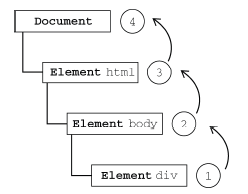
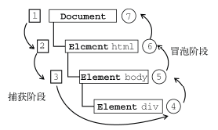

#JavaScript 高级程序设计

## 事 件

>JavaScript与HTML之间的交互是通过事件实现的。事件，就是文档或浏览器窗口中发生的一些特定的交互瞬间。可以使用侦听器（或处理程序）来预订事件，以便事件发生时执行相应的代码。这种在传统软件工程中被称为观察员模式的模型，支持页面的行为（JavaScript代码）与页面的外观（HTML和CSS代码）之间的松散耦合。

### 事件流

事件流描述的是从页面中接收事件的顺序。IE的事件流是`事件冒泡流`，而Netscape Communicator的事件流是`事件捕获流`

#### 事件冒泡

>event bubbling:事件开始时由最具体的元素(文档中嵌套层次最深的那个节点)接收，然后逐级向上传播到较为不具体的节点(文档).

例如：

```html
<!DOCTYPE html>
<html>
<head>
    <title>Event Bubbling Example</title>
</head>
<body>
    <div id="myDiv">Click Me</div>
</body>
</html>
```

如果单击了页面中的<div\>元素，那么这个`click`事件会按照如下顺序传播



*IE9、Firefox、Chrome 和Safari 则将事件一直冒泡到window 对象。*

#### 事件捕获

>event capturing:不太具体的节点应该更早接收到事件，而最具体的节点应该最后接收到事件。它的用意在于在事件到达目标之前捕获它。

仍以之前的例子，事件捕获的过程为：


*IE9、Safari、Chrome、Opera和Firefox 目前也都支持这种事件流模型。尽管“DOM2 级事件”规范要求事件应该从document 对象开始传播，但这些浏览器都是从window 对象开始捕获事件的。*

#### DOM 事件流

DOM2级事件规定的事件流包括三个阶段：`事件捕获阶段`、`处于目标阶段`和`事件冒泡阶段`。

首先发生的是事件捕获，为截获事件提供了机会，然后是实际的目标接收到事件，最后一个阶段是冒泡阶段，可以在这个阶段对事件做出响应。

仍以之前的例子，DOM事件流为：



IE9、Opera、Firefox、Chrome 和Safari 都支持DOM 事件流；IE8 及更早版本不支持DOM 事件流。

### 事件处理程序

事件就是用户或浏览器自身执行的某种动作，而响应某个事件的函数就叫做事件处理程序。

#### HTML事件处理程序

某个元素支持的每种事件，都可以使用一个与相应事件处理程序的同名的HTML特性来指定。这个特性的值应该是能够执行的JavaScript代码，或者也可以调用页面其他地方的定义的脚本。

```html
<!--直接包含JavaScript代码-->
<input type="button" value="click me" onlclick="alert(&quot;clicked&quot;)">

<!--调用页面其他地方的脚本，同时捕捉脚本错误-->
<input type="button" value="click me" onlclick="try{showMessage();}catch(ex){}">

<script>
    function showMessage(){
        alert('clicked');
    } 
</script>
```

缺点：

1. 存在一个时差问题，用户可能会在HTML元素一出现在页面上就触发相应的事件，但是由于当时事件处理程序还未加载，而导致脚本错误。

2. HTML与JavaScript代码紧密耦合。要更换事件处理程序，要改动两个地方：HTML代码和JavaScript代码

#### DOM0级事件处理程序

通过JavaScript指定事件处理程序的传统方式，就是`将一个函数赋值给一个事件处理程序属性`。

这种事件处理程序的方式至今仍然为所有现代的浏览器所支持，原因：

1. 简单
2. 具有跨浏览器优势

```javascript
var btn = document.getElementById('myBtn');

//设置事件处理程序
btn.onclick = function(event){
    alert(this.id);
};

//删除事件处理程序
btn.onclick = null;
```

不足：当需要添加多个事件处理程序时，比较麻烦

```javascript
var btn = document.getElementById('myBtn');

//设置事件处理程序1
btn.onclick = function(event){
    //事件处理程序1
};

//如果不这么做，之前的事件处理程序会被覆盖掉
var oldClickHandler = btn.onclick;

//添加事件处理程序2
btn.onclick = function(event){
    oldClickHandler();
    //事件处理程序2
}
```

#### DOM2级事件处理程序

"DOM2级事件"定义了两个方法，用于处理指定和删除事件处理程序操作。主要的好处就是`可以添加多个事件处理程序`

1. addEventListener(type,handler,caputering)

2. removeEventListener(type,handler,caputering)

这两个方法都接收3个参数

* type：事件类型

* handler：事件处理程序

* caputering：布尔值，true表示在捕获阶段调用handler，false表示在冒泡阶段调用

IE9、Firefox、Safari、Chrome 和Opera 支持DOM2 级事件处理程序。

添加多个事件处理程序

```javascript
var btn = document.getElementById('myBtn');

//添加事件处理程序1
btn.addEventListener('click',function(){},false);

//添加事件处理程序2
btn.addEventListener('click',function(){},false);
```

通过addEventListener添加的事件处理程序只能使用removeEventListener来移除。移除时传入的参数与添加程序时使用的参数相同。这意味着`通过addEventListener添加的匿名函数将无法移除`

```javascript
var btn = document.getElementById('myBtn');

//添加事件处理程序
btn.addEventListener('click',function(){
    alert(this.id);
    },false);

//无效的删除
btn.removeEventListener('click',function(){
    alert(this.id);
    },false);
```

*大多数情况下，都是将事件处理程序添加到事件流的冒泡阶段，这样可以最大限度地兼容各种浏览器。*

#### IE事件处理程序

IE实现了与DOM中类似的两个方法。

1. attchEvent(type,handler)

2. detachEvent(type,handler)

由于IE8及更早版本只支持事件冒泡，所以通过attchEvent添加的事件处理程序都会被添加到冒泡阶段

```javascript
var btn = document.getElementById('myBtn');

btn.attachEvent('onclick',function(){
    alert('clicked');
});
```

使用这两个方法要注意两点：

1. 第一个参数要加上"on"

2. 事件处理程序的作用域。在使用attachEvent的情况下，事件处理程序会全局作用域中运行。

```javascript
var btn = document.getElementById('myBtn');

btn.attachEvent('onclick',function(){
    alert(this === window); //true
});
```

#### 跨浏览器的事件处理程序

```javascript
var EventUtil = {
    addHandler : function(element,type,handler){
        if(element.addEventListener){
            element.addEventLisener(type,handler,false);
        } else if (element.attachEvent){
            element.attachEvent('on' + type,handler);
        } else {
            element['on' + type] = handler;
        }
    },
    removeHandler : function(element,type,handler){
        if(element.removeEventListener){
            element.removeEventListener(type,handler,false);
        } else if (element.detachEvent){
            element.detachEvent('on' + type,handler);
        } else {
            element['on' + type] = null;
        }
    }
}
```

### 事件对象

>在触发DOM上的某个事件时，会产生一个事件对象event，这个对象中包含着所有与事件有关的信息。包括导致事件的元素、事件的类型以及其他与特定事件相关的信息。例如，鼠标操作导致的事件对象中，会包含鼠标位置的信息，而键盘操作导致的事件对象中，会包含与按下的键有关的信息。所有浏览器都支持event 对象，但支持方式不同。

#### DOM中的事件对象

兼容DOM的浏览器会将一个event对象传入到事件处理程序中。

只有在事件处理程序执行期间，event对象才会存在；一旦事件处理程序执行完成，`event 对象就会被销毁`。

**event对象的属性和方法**


1. currentTarget target

    在事件处理程序内部，`对象的this始终等于currentTarget`的值，而target则`只包含事件的实际目标`。

2. preventDefault()

    只有cancelable属性设置为true的事件，才可以使用preventDefault()来取消其默认行为。

3. stopPropagation() 

    立即停止事件在DOM层次的传播，即取消进一步的事件捕获或冒泡

4. eventPhase

    确定事件当前位于事件流的哪个阶段

    * 捕获阶段：eventPhase为1
    
    * 处于目标对象上：eventPhase为2
    
    * 冒泡阶段：eventPhase为3
    
    ```javascript
    var btn = document.getElementById('myBtn');
    btn.onclick = function(event){
        alert(event.eventPhase);//2
    }
    ```

#### IE中的事件对象

**访问event对象**

* 在使用DOM0级添加事件处理程序时，event对象作为window对象的一个属性

```javascript
var btn = document.getElementById('myBtn');
btn.onclick = function(){
    var event = window.event;
    alert(event.type); //click
}
```

* 如果使用attachEvent添加，event对象会作为参数被传入事件处理函数

```javascript
var btn = document.getElementById('myBtn');
btn.attachEvent('onclick',function(event){
    alert(event.type); //click
})
```

**IE中event对象的属性和方法**


1. event.srcElement(event.target)

   ```javascript
   var btn = document.getElementById('myBtn');
   btn.onclick = function(){
        alert(window.event.srcElement === this);//true
   };
   btn.attachEvent('onclick',function(event){
        alert(window.event.srcElement === this); //false
    });
   ```

2. event.returnValue(event.preventDefault())

    取消给定事件的默认行为，只要将returnValue设为false

    ```javascript
    var link = document.getElmentById('myLink');
    link.onclick = function(){
        window.event.returnValue = false;
    }
    ```

3. cancelBubble(event.stopPropagation())

    停止事件冒泡。设置cancelBubble为true

    ```javascript
    var btn = document.getElementById('myBtn');
    btn.onclick = function(){
        alert('clicked');
        window.event.cancelBubble = true;
    };
    ```

#### 跨浏览器的事件对象

```javascript
var EventUtil = {
    addHandler : function(element,type,handler){
        if(element.addEventListener){
            element.addEventLisener(type,handler,false);
        } else if (element.attachEvent){
            element.attachEvent('on' + type,handler);
        } else {
            element['on' + type] = handler;
        }
    },
    removeHandler : function(element,type,handler){
        if(element.removeEventListener){
            element.removeEventListener(type,handler,false);
        } else if (element.detachEvent){
            element.detachEvent('on' + type,handler);
        } else {
            element['on' + type] = null;
        }
    },
    getEvent : function(event){
        return event ? event : window.event;
    },
    getTarget : function(event){
        return event.target || event.srcElement;
    },
    preventDefault : function(event){
        if(event.preventDefault){
            event.preventDefault();
        } else {
            event.returnValue = false;
        }
    },
    stopPropagation : function(event){
        if(event.stopPropagation){
            event.stopPropagation();
        } else {
            event.cancelBubble = true;
        }
    }
}
```

### 事件类型

Web浏览器中可能发生的事件有很多类型。如前所述，不同的事件类型具有不同的信息，而"DOM3级事件"规定了以下几类事件。

1. UI（User Interface，用户界面）事件，当用户与页面上的元素交互时触发；

2. 焦点事件，当元素获得或失去焦点时触发；

3. 鼠标事件，当用户通过鼠标在页面上执行操作时触发；

4. 滚轮事件，当使用鼠标滚轮（或类似设备）时触发；

5. 文本事件，当在文档中输入文本时触发；

6. 键盘事件，当用户通过键盘在页面上执行操作时触发；

7. 合成事件，当为IME（Input Method Editor，输入法编辑器）输入字符时触发；

8. 变动（mutation）事件，当底层DOM 结构发生变化时触发。

9. 变动名称事件，当元素或属性名变动时触发。此类事件已经被废弃。

DOM3 级事件模块在DOM2 级事件模块基础上重新定义了这些事件，也添加了一些新事件

#### UI事件

1. load

    当页面完全加载后在window上面触发，当所有框架都加载完毕时在框架集上面触发，当图像加载完毕时在元素上面触发，或者当嵌入的内容加载完毕时在<object\>元素上面触发。

2. unload

    当页面完全卸载后在window上面触发，当所有框架都卸载后在框架集上面触发，或者当嵌入的内容卸载完毕后在<object\>元素上面触发。

3. abort

    在用户停止下载过程时，如果嵌入的内容没有加载完，则在<object\>元素上面触发。

4. error

    当发生JavaScript错误时在window上面触发，当无法加载图像时在元素上面触发，当无法加载嵌入内容时在<object\>元素上面触发，或者当有一或多个框架无法加载时在框架集上面触发

5. select

    当用户选择文本框（<input\>或<texterea\>）中的一或多个字符时触发

6. resize

    当窗口或框架的大小变化时在window 或框架上面触发。

7. scroll

    当用户滚动带滚动条的元素中的内容时，在该元素上面触发。<body\>元素中包含所加载页面的滚动条。

8. DOMActive
    
    不建议使用

检测浏览器是否支持DOM2级事件规定的HTML事件

```javascript
var isSupported = document.implementation.hasFeature("HTMLEvents", "2.0");
```

**事件详解**

1. load

    当页面完全加载后（包括所有图像、JavaScript文件、CSS文件等外部资源），就会触发window上面的load事件。

    *根据“DOM2 级事件”规范，应该在document而非window上面触发load事件。但是，所有浏览器都在window上面实现了该事件，以确保向后兼容。*

    1. 定义onload事件处理程序的方式1：

        虽然会给事件处理程序传入一个event对象，但是这个event对象不会包含这个事件的任何附加信息。

        ```javascript
        //方式1
        EventUtil.addHandler(window,'load',function(event){
            alert('loaded');
        });
        ```

    2. 定义onload事件处理程序的方式2：
        
        为<body\>元素添加一个onload属性

        ```html
        <!DOCTYPE html>
        <html>
        <head>
            <title>Load Event Example</title>
        </head>
        <body onload="alert('Loaded!')">
            
        </body>
        </html>
        ```

    在创建新的元素时，可以为其指定一个事件处理程序，以便图像加载完毕后给出提示。

    ```javascript
    EventUtil.addHandler(window,'load',function(){
        var image = document.createElement('img');
        EventUtil.addHandler(image,'load',function(event){
            event = EventUtil.getEvent(event);
            alert(EventUtil.getTarget(event).src);
        });
        document.body.appendChild(image);
        image.src = 'smile.gif';
    });
    ```

    在IE9+、Firefox、Opera、Chrome 和Safari 3+及更高版本中，&lt;script&gt;元素也会触发load 事件，以便开发人员确定动态加载的JavaScript 文件是否加载完毕

    ```javascript
    EventUtil.addHandler(windwo,'load',function(){
        var script = document.createElement('script');
        EventUtil.addHandler(script,'load',function(event){
            alert('loaded');
        });
        script.src = 'example.js';
        document.body.appendChild(script);
    });
    ```

2. unload

    这个事件在文档被完全卸载后触发，只要用户从一个页面切换到另一个页面，就会发生unload事件，而利用这个事件最多的情况是`清除引用，以避免内存泄漏`。

    *跟使用load事件的方式一样*

3. resize

    当浏览器窗口被调整到一个新的高度或者宽度时，就会触发resize事件。这个事件在window上面触发，因此可以通过JavaScript或<body\>元素中的onresize属性来指定事件处理程序。

    关于何时会触发resize事件，不同浏览器有不同的机制。IE、Safari、Chrome和Opera会在浏览器窗口变化了1px时，就触发resize事件，然后随着变化不断触发。Firefox则会在用户停止调整窗口大小时，才会触发resize事件。由于存在这个差别，应该注意`不要在这个事件的处理程序中加入大计算量的代码，因为这些代码有可能被频繁执行，从而导致浏览器反应变慢`。

    *浏览器窗口最小化或最大化时也会触发resize事件*

4. scroll

    虽然scroll事件是在window对象上发生的，但它实际表示的则是页面中相应元素的变化。在混杂模式下，可以通过<body\>元素的scrollLeft和scrollTop来监控到这一变化；而在标准模式下，除Safari 之外的所有浏览器都会通过<html>元素来反映这一变化（Safari 仍然基于<body>跟踪滚动位置）。

    与resize事件类似，scroll事件也会在文档被滚动期间重复被触发，所以有必要尽量保持事件处理程序的代码简单。

#### 焦点事件

焦点事件会在页面元素获得或失去焦点时触发。利用这些事件并与document.hasFocus()方法及document.activeElement 属性配合，可以知晓用户在页面上的行踪。

有6个焦点事件：

* blur：在元素失去焦点时触发。这个事件不会冒泡；所有浏览器都支持它。

* focus：在元素获得焦点时触发。这个事件不会冒泡；所有浏览器都支持它。

* focusin：在元素获得焦点时触发，与HTML事件focus等价。

* focusout：在元素失去焦点时触发，HTML事件blur的通用版本。

* DOMFocusIn：在元素获得焦点时触发，DOM3级事件废弃了。

* DOMFocusOut：在元素失去焦点时触发，DOM3级事件废弃了。

当焦点从页面中的一个元素移动到另一个元素，会依次触发下列事件：

1. focusout在失去焦点的元素上触发；
2. focusin在获得焦点的元素上触发；
3. blur在失去焦点的元素上触发；
4. DOMFocusOut在失去焦点的元素上触发（只有Opera支持）；
5. focus在获得焦点的元素上触发；
6. DOMFocusIn在获得焦点的元素上触发（只有Opera支持）；

这类事件中最主要的是focus和blur，但是最大的问题是`它们不冒泡`，但是可以在捕获阶段侦听到它们。

```javascript
//确定浏览器是否支持这些事件
var isSupported = document.implementation.hasFeature('FocusEvent','3.0');
```

#### 鼠标与滚轮事件

**DOM3级定义了9个鼠标事件**

1. click

    在用户单击主鼠标按钮（一般是左边的按钮）或者按下回车键时触发。这一点对确保易访问性很重要，意味着`onclick事件处理程序既可以通过键盘也可以通过鼠标执行`

2. dbclick

    在用户双击主鼠标按钮（一般是左边的按钮）时触发。从技术上说，这个事件并不是DOM2级事件规范中规定的，但鉴于它得到了广泛支持，所以DOM3级事件将其纳入了标准

3. mousedown

    在用户按下了任意鼠标按钮时触发。不能通过键盘触发这个事件。

4. mouseenter

    在鼠标光标从元素外部首次移动到元素范围之内时触发。这个事件`不冒泡`，而且在光标移动到后代元素上不会触发。DOM2级事件并没有定义这个事件，但DOM3级事件将它纳入了规范。IE、Firefox 9+和Opera 支持这个事件。

5. mouseleave

    在位于元素上方的鼠标光标移动到元素范围之外时触发。这个事件`不冒泡`，而且在光标移动到后代元素上不会触发。DOM2级事件并没有定义这个事件，但DOM3级事件将它纳入了规范。IE、Firefox 9+和Opera 支持这个事件。

6. mousemove

    当鼠标指针`在元素内部移动时重复地触发`。不能通过键盘触发这个事件。

7. mouseout

    在鼠标指针位于一个元素上方，然后用户将其移入另一个元素时触发。又移入的另一个元素`可能位于前一个元素的外部，也可能是这个元素的子元素。`不能通过键盘触发这个事件。

8. mouseover

    在鼠标指针位于一个元素外部，然后用户将其`首次移入`另一个元素边界之内时触发。不能通过键盘触发这个事件。

9. mouseup

    在用户释放鼠标按钮时触发。不能通过键盘触发这个事件。

此外，还有一个类滚轮事件，就是一个`mousewheel`事件。这个事件跟踪鼠标滚轮，类似于Mac的触发板。

**鼠标事件与其他事件密不可分**

取消鼠标事件将会影响浏览器的默认行为，进而还会影响其他事件。例如：只有在同一个元素上相继触发mousedown和mouseup事件，才会触发click事件；如果mousedown或mouseup中的一个被取消，就不会触发click事件。

click，mousedown，mouseup，dbclick事件触发的顺序:

    1. mousedown

    2. mouseup

    3. click

    4. mousedown

    5. mouseup

    6. click

    7. dbclick

    显然，click和dbclick事件都会依赖于先行事件的触发。

    在IE8及其之前的版本，有一个bug：
    
    1. mousedown
    2. mouseup
    3. click
    4. mouseup
    5. dbclick

检测浏览器是否支持DOM2级事件（除dbclick、mouseenter和mouseleave）

```javascript
var isSupported = document.implementation.hasFeature('MouseEvents','2.0');
```

检测浏览器是否支持上面的所有事件，即DOM3级事件

```javascript
var isSupported = document.implementation.hasFeature('MouseEvent','3.0');
```

**客户区坐标位置**


