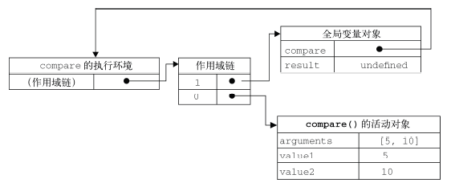
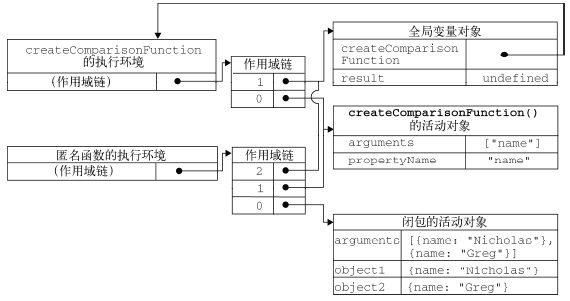

#JavaScript 高级程序设计

##函数表达式

###函数表达式的特征
***

####定义函数

**1. 函数声明**
			 	
	函数声明提升（function declaration hoisting）:在执行代码之前会先读取函数声
	明，意味可以把函数声明放在调用它的语句后面

**2. 函数表达式**

```javascript
	var functionName = function(){};
```

	最常见的形式，即创建一个函数并将它赋值给变量，这种情况创建的函数叫做匿名函
	数(anonymous function 拉姆达函数)函数表达式在使用前必须先赋值

### 递归
***

>递归函数是在一个函数通过名字调用自身的情况下构成的。

使用arguments.callee代替函数名，可以确保无论怎样调用函数都不会出问题
		
```javascript
	function factorial(num){
		if (num <= 1){
			return 1;
		} else {
			return num * arguments.callee(num - 1);
		}
	}
	var anotherFactorial = factorial;
	anotherFactorial(4)
```

在严格模式下，不能通过脚本使用arguments.callee，不过可以使用命名函数表达式来
达成相同的结果
		
```javascript
	var factorial = (function f(num){
			if (num <= 1){
				return 1;
			} else {
				return num * f(num - 1);
			}
		});
```

### 闭包
***

>是指`有权访问另一个函数作用域中的变量的函数`。创建闭包的常见方式，就是在一个函数内部创建另一个函数。

**调用函数过程**

>当某个函数被调用时，会创建一个执行环境(execution context)及相应的作用域链，然后使用arguments和其他命名参数的值来初始化函数的活动对象(activation oject)，在作用域链中，外部函数的活动对象始终处于第二位，外部函数的外部函数的活动对象处于第三位...直至作为作用链终点的全局执行环境。

```javascript
	function compare(v1,v2){
		if (v1 < v2){
			return -1;
		} else if (v1 > v2){
			return 1;
		} else {
			return 0;
		}
	}
	var result = compare(5,10);
```



>在创建compare()函数时，会创建一个预先包含全局变量对象的作用域链，这个作用域链被保存在内部的\[\[Scope\]\]属性中，当调用compare()函数时，会为函数创建一个执行环境，然后通过复制函数的\[\[Scope\]\]属性中对象构建起执行环境的作用域链，此后又有一个活动对象（在此作为变量对象使用）被创建并被推入执行环境作用域链的前端。显然，作用域链本质上是一个指向变量对象的指针列表，它只引用但不实际包含变量对象。

**闭包的形成**

```javascript
	function createComparisonFunction(propertyName) {
		return function(object1, object2){
			var value1 = object1[propertyName];
			var value2 = object2[propertyName];
			if (value1 < value2){
				return -1;
			} else if (value1 > value2){
				return 1;
			} else {
				return 0;
			}
		};
	}
	var compare = createComparisonFunction('name');
	var result = compare({name:'zhang'},{name:'foo'});
	/*
		解除对匿名函数的引用，以便释放内存，随着匿名函数
		的作用域链被销毁，其他作用域也都可以安全地被销毁
		（除了全局作用域）
	*/	
	compare = null;
```



>在匿名函数从createComparisonFunction中被返回后，它的作用域链被初始化为包含createComparisonFunction()函数的活动对象和全局变量对象。这样，匿名函数就可以被访问在createComparisonFunction()中定义的所有变量，而当createComparisonFunction()在执行完毕时，其活动对象也不会被销毁，因为匿名函数的作用域链仍然在引用这个活动对象。也就是说，当createComparisonFunction()函数返回后，其执行环境的作用域链会被销毁，但它的活动对象仍然会留在内存中，直到匿名函数被销毁后，createComparisonFucntion()的活动对象才会被销毁。

*闭包会携带包含它的函数作用域，因此会比其他函数占用更多的内存，过度使用闭包可能会导致内存占用过多。*

**闭包与变量**

>作用域链的这种配置机制引出了一个值得注意的副作用，即闭包只能取得包含函数中任何变量的最后一个值，别忘了闭包所保存的是整个变量对象。

```javascript
	function f(){
		var result = [];
		for(var i = 0;i < 10;i++){
			result[i] = function(){
				return i;
			};
		}
		return result;
	}
	var r = f();
	r[0]();//10
	r[9]();//10 
```

*可以通过创建另一个匿名函数强制让闭包的行为符合预期*

```javascript
	function f(){
		var result = [];
		for(var i = 0;i < 10;i++){
			result[i] = function(num){
return function(){
					return num;
				};
			}(i);
		}
		return result;
	}
```

*result数组中的每个函数都有自己的num变量的一个副本，就可以返回各自不同的数值了。*

**关于this对象**

>在闭包中使用this对象也可能会导致一些问题。this对象是在运行时基于函数的执行环境绑定的：在全局函数中，this等于window，而当函数被作为某个对象的方法调用时，this等于那个对象，不过，匿名函数的执行环境具有全局性，因此其this对象通常指向window

```javascript
	var name = 'window';
	var object = {
		name : 'object',
		getName : function(){
			return function(){
				return this.name;
			};
		}
	};
	object.getName()(); //window
```

*要想达到预期的行为，可以把外部的作用域中的this对象保存在一个闭包能够访问到的变量里，就可以让闭包访问该对象*

```javascript
	var name = 'window';
	var object = {
		name : 'object',
		getName : function(){
			**var that = this;**
			return function(){
				return that.name;
			};
		}
	};
	object.getName()(); //object
```

***几种特殊的情况下，this的值可能会意外地改变***

```javascript
	var name = 'window';
	var object = {
		name : 'object',
		getName : function(){
				return this.name;
		}
	};
	object.getName();//object
	(object.getName)();//object
	object.getName = object.getName; //function(){return this.name;}
	(object.getName = object.getName)();//window
```

*最后一行先执行了一条赋值语句，然后再调用赋值后的结果，结果就是*

```javascript
	(functin(){return this.name;})()
```


**内存泄漏**

>如果闭包的作用域链中保存这一个HTML元素，就意味着该元素将无法被销毁

```javascript
	function handler(){
		var element = document.getElementById('id');
		element.onclick = function(){
			console.log(element.id);
		};
	}
```

*以上代码创建了一个作为element元素事件处理程序的闭包，而这个闭包则有创建了一个循环引用。只要匿名函数存在，elements的引用数至少为1，因此它所占用的内存就永远不会被回收。*

```javascript
	function handler(){
		var e = document.getElementById('id');
		var id = e.id;
		e.onclick = function(){
			alert(id);
		};
		e = null;
	}
```

*有必要将e变量设置为null，这样就可以解除对DOM对象的引用，顺理地减少其引用数，确保正常回收其占有的内存*

### 模仿块级作用域
***

>JavaScript没有块级作用域的概念，但有函数作用域。

**匿名函数模仿块级作用域**

```javascript
	(function(){
		//这里是块级作用域
	})();

	function(){
		//
	}(); //error!
```

*这种技术经常在全局作用域中被用在函数外部，从而限制向全局作用域添加过多的变量和函数。*

*这种做法可以减少闭包占用的内存问题，因为没有指向匿名函数的引用，只要函数执行完毕，就可以立即销毁其作用域链*

###私有变量

>严格来讲，JavaScript没有私有成员的概念：所有对象属性都是公开的倒是有一个私有变量的概念：任何在函数中定义的变量，都可以认为是私有变量，因为不能在函数的外部访问这些变量。

**私有变量**

>把有权访问私有变量和私有函数的公有方法称为特权方法

在构造函数中定义特权方法（privileged method）

```javascript
	function MyObject(){
		//私有变量和私有函数
		var privateVariable = 10;
		function privateFunction(){
			return false;
		}

		//特权方法
		this.publicMethod = function(){
			priveteVariable++；
			return priveteFunction();
		}
	}
```

*能够在构造函数中定义特权方法是因为特权方法作为闭包有权访问构造函数中定义的所有变量和函数*

缺点

	构造函数针对每个实例都会创建同样一组新方法

**静态私有变量**

通过在私有作用域中定义私有变量或函数，同样也可以创建特权方法

```javascript
	//对象
	var MyObject = function(){};

	//私有作用域
	(function(){

		//私有变量和私有函数
		var privateVariable = 10;

		function privateFunction(){
			return false;
		}

		//公有或特权方法
		MyObject.prototype.publicMethod = function(){
			privateVariable++;
			return privateFunction();
		};

	})();
```

缺点

	多次查找作用域链中的一个层次，就会在一定程度上影响查找速度，这也是使用闭包
	和私有变量的一个明显的不足之处

**模块模式**

>module pattern，为单例创建私有变量和特权方法，所谓的单例(singleton),指的是只有一个实例的对象。按照惯例，JavaScript是以对象字面量的方式来创建单例对象的。

```javascript
	var singleton = function(){

			//私有变量和私有函数
			var privateVariable = 10;

			function privateFucntion(){};

			//特权方法和属性
			return {
				publicProperty : true,
				publicMethod : function(){
					privateVariable++;
					return privateFunction();
				}
			};
		}();
```

*从本质上将，对象字面量定义是单例的公共接口，这种模式在需要对单例进行某些初始化，同时又需要维护其私有变量时是非常有用的，此外单例通常都是作为全局对象存在，我们不会将它传递给一个函数*

**增强的模块模式**

这个模式适合那些单例必须是某种类型的实例，同时还必须添加某些属性和方法的情况

```javascript
	var singleton = function(){

		//私有变量和私有函数
		var privateVariable = 10;

		function privateFunction(){};

		//创建对象
		var object = new CustomType();

		//添加公有属性和方法
		object.publicProperty = true;
		object.publicMethod = function(){
			privateVariable++;
			return  privateFunction();
		};

		//返回这个对象
		return object;
	}();
```


