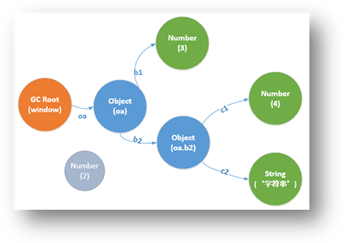
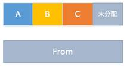
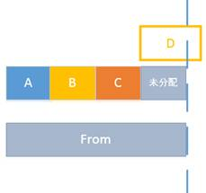
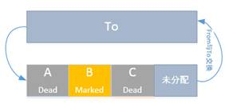
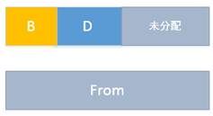
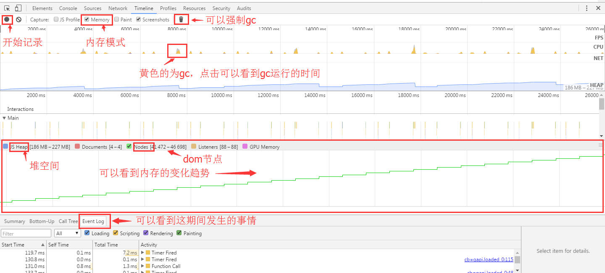
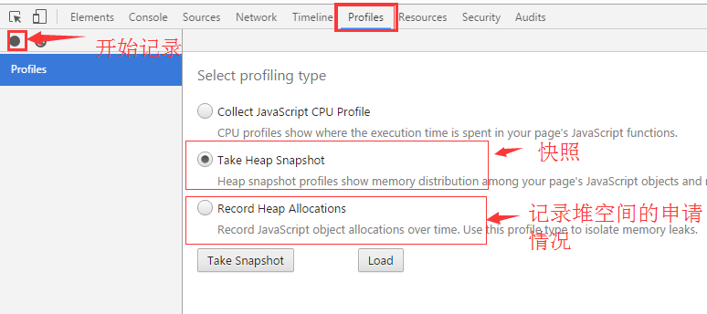

# 内存管理

> 本文以V8引擎作为背景

## 一、前言

### 1. 概述

内存话题有很多，本文覆盖的内容有：

1. 内存的组织形式
2. 内存的分配
3. 内存的回收（gc）
4. 内存的问题、检测、解决
    
    * 内存占有过多
    * 内存泄漏
    * gc频繁卡顿

### 2. 术语

1. Shallow Size：Shallow size of an object is the amount of memory allocated to store the object itself, not taking into account the referenced objects. 【即自身所占用的内存大小】

2. Retained size：Retained size of an object is its shallow size plus the shallow sizes of the objects that are accessible, directly or indirectly, only from this object. 【对象本身所有大小+对象所引用的内存空间的大小】

3. GC：Garbage Collection，是一种自动的内存管理机制。当一个电脑上的动态内存不再需要时，就应该予以释放，以让出内存，这种内存资源管理，称为垃圾回收（garbage collection）。

4. Native Object：object in an ECMAScript implementation whose semantics are fully defined by this specification rather than by the host environment.【内置对象，即js提供的对象，例如Date，Math，String等】

5. Host Object：object supplied by the host environment to complete the execution environment of ECMAScript.【宿主对象，例如window，history等】

6. Object Wrapper：The Object constructor creates an object wrapper for the given value. If the value is null or undefined, it will create and return an empty object, otherwise, it will return an object of a Type that corresponds to the given value. ex：var wrapper = new Object();【其实就是我们所称的对象实例的名称】

## 二、内存的组织方式

程序的内容管理方式基于`图`的概念：

* 以`GC Root`为根节点
* 以变量值或属性值为节点
* 以变量名或属性名为边的图

例如一段代码

```javascript
window.ob = 2;
window.oa = {
    b1 : 3,
    b2 : {
        c1 : 4,
        c2 : "字符串"
    }
};
window.ob = undefined;
```



**GC Root**

GC Root是内存的根节点，在浏览器中它是window，在Nodejs中则是global对象

* 图的节点名称是创建它的构造函数名
* 图的边是引用它的属性名或者变量名

有很多内部的GC Root对用户来说都不是很重要，从应用的角度来说有下面几种情况：

* Window全局对象（在所有iframe中），在堆快照中，有一个distance字段，它是从window对象到达对应对象的最短路径长度
* 由所有的document能够遍历到的DOM节点组成的文档DOM树，不是所有节点都有被js引用，但是，有JS引用的节点在document存在的情况下都会被保留在内存中。
* 有很多对象可能在调试代码（保存上下文）或者DevTools的console中保留下来，因此在进行堆快照的时候有断点调试或者控制台输出

**活节点 vs 垃圾**

* 从GC Root开始遍历图，所有能到达的节点称为活节点。
* GC Root不能到达的节点，该节点就成为垃圾，将会被回收。

例如图中灰色的节点，它原来代表ob变量值，当`window.ob = undefined`后，此节点与GC Root连接的路径ob被切断了，它就成了垃圾，将会被回收。

## 三、内存的分配

### 1. JavaScript类型的内存分配

**基本类型**

它们不会引用别的值，它们只会是叶子节点或终止节点。

* Number（两种存储方式）

    * 31位整数直接值，称做：小整数(small integers)(SMIs)，或者当一个值需要被打包
    * 堆对象，引用为堆值。堆值是用来存储不适合用SMI形式存储的数据，像双精度数(doubles)，或者当一个值需要被打包(boxed)时，如给这个值再设置属性值。

* String（两种存储方式）

    * VM堆
    * 外部的渲染器内存中。这时会创建一个包装对象用来访问存储的位置，比如，Web页面包存的脚本资源和其它内容，而不是直接复制至VM堆中

* boolean

**Object类型**

* Native Objects(内置对象)是所有不在JavaScript中的对象，与堆对象不同的是，在它们的生命周期中，不会被V8垃圾回收器处理，只能通过JavaScript Object Wrapper来进行引用。？？

* Arrays(数组)是数字类型键的对象，它们在V8引擎中存储大数据量的数据时被广泛的使用，像字典这种有键-值对的对象就是用数组实现的。

* 一个典型的JavaScript对象可以通过两种数组类型之一的方式来存储：命名属性和数字化的元素，如果只有少量的属性，它们会被直接存储在JavaScript对象本身中。？？

* Object groups(对象组)，每个Native Object group都是有一组之间相互关联的对象组成的，例如说一个DOM子树，每个节点与父元素，子元素，兄弟元素相互连接，构成一个图。需要注意的是Native Object不存在JavaScript堆中，因此它们的大小为0（内存分析的时候），我们需要注意的是Object group的object wrapper，我们通过object wrapper来对object group进行操作。在正常情况下，GC是足够智能的，能够分辨那些已经没有object wrapper的Native object，并且释放它们。


### 2. 使用内存的大小

从前两小节来看，JavaScript变量对内存的使用分为

**1. Shallow Size（直接占有内存）**

典型的JavaScript对象都会有保留内存用来描述这个对象和存储它的直接值。一般，只有数组和字符串会有明显的直接占用内存(Shallow Size)。

**2. Retained Size（占有总内存）**

一般要注意的，就是Retained Size，一个自身很小的变量，可能引用了一个很大的DOM节点，因此它的Retain Size就非常地大。

## 四、垃圾回收

### 1. 背景了解

Chrome 41版本包括了一个针对渲染引擎的任务调度器（Task Scheduler），以确保Chrome浏览器一直保持响应和流畅，任务调度器使延迟敏感的任务拥有更高的优先级。为了实现这一目标，任务调度器需要获取多种信息，包括系统的繁忙程度，哪些任务需要被执行，以及这些任务的紧迫程度。在此基础上，任务调度器可以评估Chrome什么时候可能空闲，以及预计会空闲多久。

举一个简单的例子，当Chrome在网页上播放一段视频的时候。视频在屏幕上的更新速率为60帧每秒（FPS），即Chrome大概每次有16.6ms的时间来进行更新。这样，Chrome将在前一帧显示后立刻启动当前帧的工作，为当前帧执行输入和渲染任务。如果Chrome完成所有这些工作用时不到16.6ms，在剩下的时间内， Chrome浏览器处于闲置状态。此时，调度器通过调度一些特殊的空闲任务（Idle Tasks）可以使Chrome能够利用这些空闲时间。如下图所示。


空闲任务是一些特殊的低优先级任务，它们在调度器确定Chrome空闲的时候才被运行。空闲任务拥有一个截止时间，截止时间是调度器估计Chrome能够保持空闲的时间。例如，在视频播放的例子中，截止时间是下一帧应该开始的时间。在其他情况下，截止时间可能是下一个待处理任务计划运行的时间，通常其有一个50ms的上限，以确保Chrome浏览器对突然的用户输入仍能保持响应。空闲任务的截止时间能够被用来估算在不会造成用户输入响应延迟的情况下Chrome可以完成的工作量。

垃圾回收就是一种典型空闲任务，其隐藏在一些关键的、延迟敏感的任务背后。这意味着这些垃圾回收任务是在没有影响用户体验的情况下，在Chrome的空闲时间内被执行。

### 2. V8的垃圾回收策略

V8采用了一个分代（Generational）垃圾回收器，将内存堆分割为

* 新生代（Young Generation）:新生代的对象为存活时间较短的对象
* 老生代（Old Generation）：老生代中的对象为存活时间较长或常驻内存的对象

由于绝大多数对象的生存期很短，只有少数对象的生存期较长，这种分代策略能使垃圾回收器对新生代对象执行一些规则的、小的垃圾回收（被称为Scavenge）。V8分别对新生代对象和老生代对象使用不同的垃圾回收算法来提升垃圾回收的效率。

**YG的Semi-space分配策略**

YG使用半空间（Semi-space）分配策略，其中新对象最初分配在新生代的活跃半空间内。一旦半空间已满，一个Scavenge操作将活跃对象移出到其他半空间中，被认为是长期驻存的对象，并被晋升为老生代。一旦活跃对象已被移出，则在旧的半空间中剩下的任何死亡对象被丢弃。

具体的如下：

YG被平分为两部分空间From和To，所有内存从To空间被分配出去，当To满时，开始触发GC。

例如说：

某时刻，To已经为A、B和C分配了内存，当前它只剩下一小块内存未分配。而From所有的内存都空闲着。



此时，一个程序需要为D分配内存，但D需要的内存大小超出了To未分配的内存，此时触发GC，页面停止执行



接着From和To进行对换，即原来的To空间被标志为From，From被标志为To。并且把活的变量值（B）标志出来，而垃圾（A、C）未被标志，它们将会被清掉。



活跃的变量（B）会被复制到To空间，而垃圾（A、C）则被回收。同时，D被分配到To空间，最后的情况如下。



至此，整个GC完成，此过程中页面会阻塞，所以要尽可能的快。

*当YG中的值存活比较久时，它会被推向OG，OG的空间满时，触发OG内的GC，OG的GC会触发YG的GC*

**OG的Mark-Sweep策略**

老生代所保存的对象大多数是生存周期很长的甚至是常驻内存的对象，而且老生代占用的内存较多，通常包含有上百MB的数据。因此，V8在老生代中的垃圾回收采用标记-清除（Mark-Sweep）和Mark-Compact相结合的策略。

标记时间取决于必须标记的活跃对象的数目，对于一个大的web应用，整个堆栈的标记可能需要超过100ms。由于全停顿会造成了浏览器一段时间无响应，所以V8使用了一种增量标记的方式标记活跃对象，将完整的标记拆分成很多小的步骤，每做完一部分就停下来，让JavaScript的应用线程执行一会，这样垃圾回收与应用线程交替执行。V8可以让每个标记步骤的持续时间低于5ms。

由于标记完成后，所有对象都已经被标记，即不是活跃对象就是死亡对象，堆上有多少空间已经确定。清除时，垃圾回收器会扫描连续存放的死对象，将其变成空闲空间。这个任务是由专门的清扫线程同步执行。

**Memory Compaction（内存紧缩）**

为减少老生代对象产生的内存碎片

### 3. 总结

总结一下，四个主要的垃圾回收任务：

1. 新生代对象的Scavenge，这通常是快速的；

2. 通过增量方式的标记步骤，依赖于需要标记的对象数量，时间可以任意长；

3. 完整垃圾回收，这可能需要很长的时间；

4. 带内存紧缩的完整垃圾回收，这也可能需要很长的时间，需要进行内存紧缩。

## 五. 内存问题、检测和解决

### 1. 内存问题概述

**1. 占有过多内存**

内存统计包括

* 堆空间的分配
* DOM节点计数
* documents文档计数
* js事件监听计数

**2. 内存泄漏**

内存泄漏是指计算机可用内存的逐渐减少，原因通常是程序持续无法释放其使用的临时内存。

具体来讲，在本文的内存图中，本应该将其与GC Root切断，但程序却错误地在它与GC Root间留了一条路径。

先来一个最简单的DOM泄漏的例子

```javascript
var el = document.getElementById("_p");
el.mark = "marked";

//移除P
function removeP() {
    el.parentNode.removeChild(el);
    // el = null;
}
```

程序非常简单，只是把id为_p的HTML元素从页面移除，在移除之前从GC Root遍历此P元素有两条路可走。在执行`removeP()`之后，按理来说该元素应该成为垃圾，所占有的内存应该被释放掉，但是由于还存在这路径el没有被切断，p元素占有的内存无法被释放，导致了内存泄漏。


**3. 频繁GC导致卡顿**

如果你的页面垃圾回收很频繁，那说明你的页面可能内存使用分配太频繁了。频繁的GC可能也会导致页面卡顿。

### 2. 检测工具

在使用Chrome进行内存分析的时候，要先在chrome菜单-》工具，或者直接按shift+esc，找到内存管理器，然后选上JavaScript使用的内存(JavaScipt Memory)。

#### timeline

通过Timeline的内存模式，可以在宏观上观察到web应用的内存情况，一般我们需要关注的点：

1. GC的时间长度是否正常？
2. GC频率是否正常？过于频繁会导致卡顿
3. 内存趋势图是否正常？
4. DOM趋势图是否正常？

这些关注点都可以在timeline的内存视图中看到，如图



timeline统计的内存变化主要有：

* js heap：堆空间
* documents：文档计数
* node：dom节点数
* event listener：事件监听器
* CPU：在手机端暂时没有

此外还可以通过`event log`看到这期间页面执行的操作

正常的内存:


来看一个[内存泄漏](https://developer.chrome.com/devtools/docs/demos/memory/example1)的例子


可以看到随着时间的增长，页面占用的内存越来越多，

在这种情况下就可以怀疑有内存泄漏了，也有可能是浏览器还没有进行gc，这个时候我们可以强制进行垃圾回收（垃圾筒图标）

反复测试，如果发现无论怎么样，内存一直在增长，那么估计你就遇到内存泄漏的问题了。

如果页面中DOM节点的数量一直在攀升，那么肯定出现DOM泄漏了


那么如何来定位问题的来源呢？这个时候就要用到面板的`profile`。

#### profile

`profile`面板我们关注的是`Take Heap Snapshot`和`Recode Heap Allocations`




**Take Heap Snapshot**


**Recode Heap Allocations**


## 引用

1. [Shallow Size & Retain Size](https://www.yourkit.com/docs/java/help/sizes.jsp)
2. [What is GC](https://zh.wikipedia.org/wiki/%E5%9E%83%E5%9C%BE%E5%9B%9E%E6%94%B6_(%E8%A8%88%E7%AE%97%E6%A9%9F%E7%A7%91%E5%AD%B8))
3. [Native Object & Host Object](http://es5.github.io/)
4. [Chrome开发者工具之JavaScript内存分析](http://web.jobbole.com/81915/)
5. [memory-101](https://developers.google.com/web/tools/chrome-devtools/profile/memory-problems/memory-101)
6. [Series on dynamic memory management](https://blogs.msdn.microsoft.com/abhinaba/2009/01/25/back-to-basic-series-on-dynamic-memory-management/)
7. [Google V8的垃圾回收引擎](http://www.infoq.com/cn/news/2015/08/Google-V8)
8. [内存泄漏的测试例子](https://developer.chrome.com/devtools/docs/demos/memory/example1)
