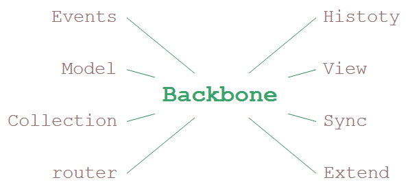
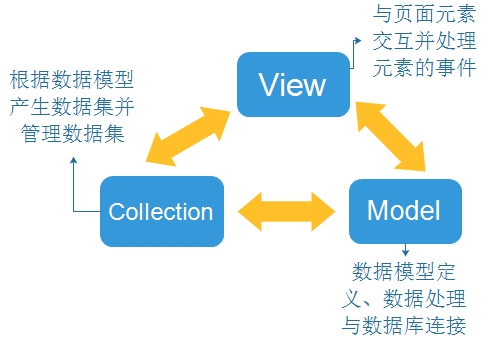
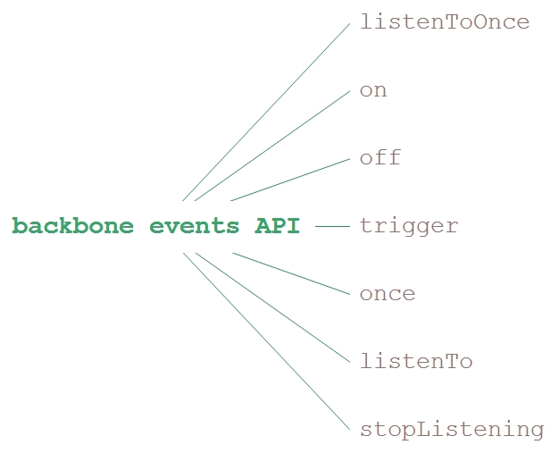

# Backbone

## 一、初识Backbone

### 1-1 Backbone的整体构成



### 1-2 Backbone的MVC结构



### 1-3 特点

1. MVC结构化

2. 继承特性

3. 事件统一管理

    在视图模型中，开发者可以通过以下代码对事件进行统一管理：

    ```javascript
    events : {
        'click #btnAdd' : 'btnAdd_Click'
    }
    ```

4. 绑定页面模版

5. 服务端无缝交互

### 1-4 依赖库

#### 1-4-1 加载

加载顺序很重要，先加载backbone的依赖的库，再加载backbone。

## 二、依赖库underscore

依赖库underscore是一个非常简洁、实用的JavaScript库，包含60多个独立的函数，这些函数可以在不扩展原生JavaScript对象的情况下，为代码的开发提供丰富的使用功能。

### underscore的类型模块


<a href="./underscore.md">详情</a>

## 三、Backbone.Events

### API结构



<a href="./events.md">详情</a>

## 四、Backbone.Model

Model在Backbone中为数据模型，是一个最基础、最根本的数据基类，用于原始数据、底层方法的封装和定义。它的结构类似于关系数据库中的映射对象，可以装载数据库中的记录信息，并通过自定义的方法，完成数据的操作之后，将数据同步到服务器中。

<a href="./model.md">详情</a>

### 4-1 Backbone.Model常见操作

### 4-2 同步数据到服务器


## 五、Backbone.Collection

Collection是依附于基类的另一个数据集合类，它的功能是管理和存储由Model衍生的数据集合。可以从数据库的角度来看，一个实例化后的Model对象好像表中的一条记录，而一个实例化后的Collection对象则是一张数据集合表，可以在这表中进行一系列的增加、删除、修改、查询的操作，还可以与服务器进行数据同步，批量更新和获取数据。

<a href="./collection.md">详情</a>

### 5-1 创建集合对象

### 5-2 集合对象的操作方法

### 5-3 与服务器的交互方法
