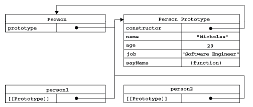
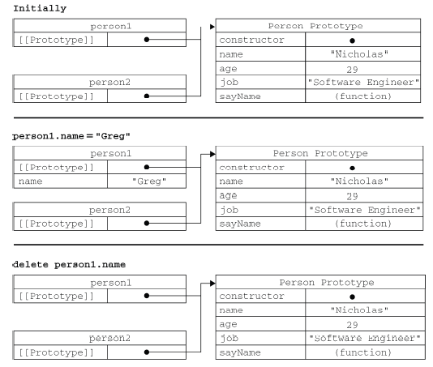
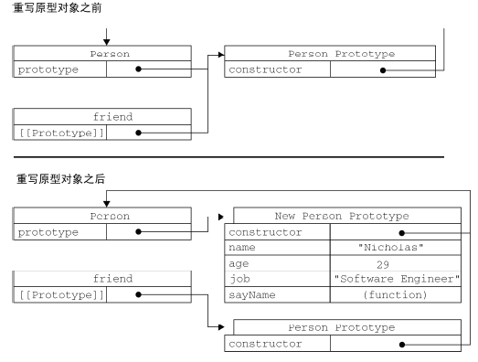
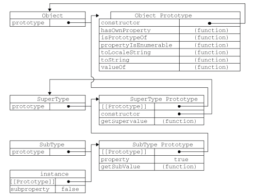

# JavaScript 高级程序设计

## 面向对象的程序设计

>ECMA-262把对象定义为：无序属性的集合，其属性可以包含基本值、对象或者函数。

### 理解对象

####属性类型

[ECMAScript5] 数据属性[Object.defineProperty()]

	1. [[Configurable]]
	2. [[Enumerable]]:for-in
	3. [[Writable]]
	4. [[Value]]:默认是undefined

```javascript
	var person = {};

	Object.defineProperty(person,'name',{
			writable:false,
			value:'zhang'
		});

	person.name;//zhang
	perosn.name = 'foo';
	person.name; //zhang
```

访问器属性[setter getter]

	它们包含一对getter和setter函数，在读取访问器属性的时候，会调用getter函数，
	返回有效的值，在写入访问器属性时，会调用setter函数，并传入新值

```javascript
	var book = {
		_year : 2004,
		edition : 1
	};

	Object.defineProperty(book,'year',{
			get : function(){
				return this._year;
			},
			set : function(newValue){
				if(newValue > 2004){
					this._year = newValue;
					this.edition += newValue - 2004;
				}
			}
		});

	book.year = 2005;
	book.edition; //2
```

定义多个属性[Object.defineProperties]

```javascript
	var book = {};
	Object.defineProperties(book,{
			_year : {
				value : 2004
			},
			edition : {
				value : 1
			},
			year : {
				get : function(){
					return this._year;
				},
				set : function(newValue){
					if(newValue > 2004){
						this._year = newValue;
						this.edition += newValue - 2004;
					}
				}
			}
		});
```

读取属性的特性[Object.getOwnPropertyDescriptor()]

```javascript
	var descriptor = Object.getOwnPropertyDescriptor(book,'_year');
	descriptor.value;
	descriptor.configurable;
```

### 创建对象

####工厂模式
***

用函数来封装以特定接口创建对象的细节

```javascript
	function createPerson(name,age,job){
		var o = new Object();
		o.name = name;
		o.age = age;
		o.job = job;
		o.sayName = function(){
			console.log(this.name);
		};
		return o;
	}
	var person = createPerson('zhang',25,'programmer');
```

*【不足】无法解决对象识别问题（类型），而且方法应该是共用的，但是这次方法实际上
每次都会创建一个新的方法.*

####构造函数模式
***

ECMAScript中的构造函数可用来创建特定的对象

```javascript
	function Person(name,age,job){
		this.name = name;
		this.age = age;
		this.job = job;
		this.sayName = function(){};
	}
	var person = new Person('zhang',25,'programmer');
```

其中，Person()与createPerson()的区别：

	·没有显示地创建对象

	·直接将属性和方法赋予this对象

	·没有return语句


之所有首字母大写是借鉴其他的OO语言，主要是为了区别与ECMAScript其他的函数，因为
构造函数本身也是函数要创建Person的实例，必须使用new操作符，以这种方式调用构造函
数实际上会经历4个步骤：

	1. 创建一个新对象

	2. 把构造函数的作用域赋予给新对象(this的指向)

	3. 执行构造函数的代码(为新对象添加属性)

	4. 返回新对象

*用这种方式创建的实例对象，它们的constructor属性都会指向Person，这也是胜过工程模式的地方*

```javascript
	person.constructor == Person //true
	person instanceof Object // true
	person instanceof Person //true
```

此外，还有两点需要注意的：

1.将构造函数当作函数构造函数与其他函数唯一的区别就是调用的方式不同，任何函数，只要通过new操作符来调用，那它就可以作为构造函数

```javascript
	//当作构造函数调用
	var person = new Person('zhang',25,'programmer');
	//作为普通函数调用
	Person('zhang',25,'programmer');
	window.sayName();//this指向window

	//在另一个对象的作用域调用
	var o = {};
	Person.call(o,'zhang',25,'programmer');
	o.sayName();//zhang
```

2.构造函数的问题就是每个方法都要在每个实例上重新创建一遍，以这种方式创建函数，会`导致不同的作用域链和标识符解析`，因此，不同实例上的同名函数是不相等的。

```javascript
	p1.sayName == p2.sayName //false
```

##### 原型模式
***

我们创建的每个函数都有一个prototype属性，这个属性是一个指针，指向一个对象，
而这个对象的用途是包含可以有特定类型的所有实例共享的属性和方法。使用原型对
象的好处是可以让所有对象实例共享它所包含的属性和方法。

```javascript
	function Person(){}
	Person.prototype.name = 'zhang';
	Person.prototype.sayName = function(){
		console.log(this.name);
	};
	var p1 = new Person();
	p1.sayName(); //zhang
	var p2 = new Person();
	p2.sayName();//zhang
```

**理解原型对象**

>无论什么时候，只要创建一个新函数，就会根据一组特定的规则为该函数创建一个prototype属性，这个属性指向函数的原型对象。默认情况下，所有原型对象都会自动获得一个constructor属性，有Person.prototype.constructor == Person当调用构造函数创建一个新实例后，该实例的内部包含一个指针，指向构造函数的原型对象，ECMA-262管这个指针叫\[\[Prototype\]\]，在Firefox,Safari和Chrome在每个对象上支持一个属性__proto__，在其他的实现上，则是不可见需要注意的是：这个连接存在于实例与构造函数的原型对象之间，而不是存在与实例与构造函数之间。



*可以通过isPrototypeOf()来确定对象之间是否存在这种关系*

```javascript
	Person.prototype.isPrototypeOf(p1) //true
```

>每当代码读取某个对象的某个属性时，都会执行一次搜索，目标是具有给定名字的属性，搜索首先从对象实例本身开始。如果在实例中找到了具有给定名字的属性，则返回属性的值，如果没有找到，则继续搜索指针指向的原型对象，在原型对象中查找具有给定名字的属性。虽然可以通过通过对象实例访问原型中的值，但是不能通过对象实例重写原型中的值，当为对象实例添加一个属性时，这个属性就会屏蔽原型对象中保存的同名属性。

```javascript
	function Person(){}
	Person.prototype.name = 'zhang';
	Person.prototype.sayName = function(){
		console.log(this.name);
	};

	var person = new Person();
	person.sayName(); //zhang
	person.name = 'foo';
	person.sayName();//foo

	delete person.name;
	person.sayName(); //zhang
```



*使用hasOwnProperty()可以知道属性是对象实例上的，或者是原型对象上的。*

**原型与in操作符**

for-in

	返回所有能够通过对象访问的，可枚举的属性，包括例中的属性和原型中的属性。要
	取得对象上所有可枚举的实例属性，可以使用Object.keys()

in

	通过对象能够访问给定属性（实例或原型）时返回true，同时使用hasOwnProperty()
	和in，就可以确定该属性存在与对象中，还是存在与原型中

```javascript
	function hasPrototypeProperty(o,name){
		return !Object.hasOwnProperty(name) && (name in o);
	}
```

**更简单的原型语法**

常见的做法是用一个包含所有属性和方法的对象字面量重写整个原型对象

```javascript
	function Person(){}
	Person.prototype = {
		name : 'zhang',
		age : 25,
		job : 'programmer',
		sayName : function(){}
	};
```

但是，使用这种方法，本质上完全重写了默认的prototype对象，因此constructor属性不
再指向Person函数，但是instanceof操作符还能返回正确的结果

```javascript
	var p = new Person();
	p instanceof Person; //true,instanceof是__proto__的指向，来判断
	p.constructor == Person; //false
```

*如果要添加constructor属性，还必须保证constructor属性的\[\[Enumable\]\]特性被设置为false*

**原型的动态性**

>可以随时为原型添加属性和方法，并且修改能够立即在所有对象实例中反映出来，如果是重写整个原型对象，则重写原型对象切断了现有原型与任何之前存在的对象实例之间的联系，它们引用的仍然是最初的原型。

```javascript
	function Person(){}
	var friend = new Person();
	Person.prototype = {
		name : 'zhang',
		age : 25,
		job : 'programmer',
		sayName : function(){}
	};
	friend.sayName(); //error
```



**原生对象的原型**

>原生的引用类型，都是采用这种模式创建的，所有原生引用类型都在其构造函数的原型上定义了方法。

**原型对象的问题**

>原型中所有属性是被很多实例共享的，这种共享对于函数非常合适，但是一般来说，实例都是要有属于自己的全部的属性的，这个问题正是我们很少看到有人单独使用原型模式的原因所在。

#### 组合使用构造函数模式和原型模式【常用】
***

>构造函数模式用于定义实例属性，原型模式用于定义方法和共享的属性，使得每个实例都会有自己的一份实例属性的副本，同时又共享着方法的引用，最大限度地节省内存

```javascript
	function Person(name,age,job){
		this.name = name;
		this.age = age;
		this.job = job;
	}
	Person.prototype = {
		constructor : Person,
		sayName : function(){
			console.log(this.name);
		}
	}
```

*这种混合模式，是目前ECMAScript中使用最广泛、认同度最高的一种创建自定义类型的方法。*

#### 动态原型模式
***

```javascript
	function Person(name,age,job){
		this.name = name;
		this.age = age;
		this.job = job;
		//只会在初次调用构造函数时才会执行
		if(typeof this.sayName != 'function'){
			Person.prototype.sayName = function(){};
		}
	}
```

####寄生构造模式

>基本思想是创建一个函数，该函数的作用仅仅是封装创建对象的代码，然后返回新创建的对象

```javascript
	/*
		创建一个具有额外方法的特殊数组，由于不能直接修
		改Array构造函数，因此可以使用这个模式
	*/
	function SpecialArray(){
		//创建数组
		var values = new Array();
		//添加值
		values.push.apply(values,arguments);
		//添加方法
		values.toPipedString = function(){
			return this.join('|');
		};
		console.log(this);
		//返回数组
		return values;
	}
	var colors = new SpecialArray('red','blue','grey');
	colors.toPipedString();//red|blue|grey
```

*这段“奇怪的代码”的原理：构造函数在不返回值的情况下，默认会返回新对象实例，通过在构造函数的末尾添加一个return语句，可以重写调用构造函数时返回的值。构造函数返回的对象与在构造函数外部创建对象没有什么不同*

```javascript
	colors instanceof SpecialArray //false
```

####稳妥构造函数模式
***

>Douglas Crockford发明了JavaScript中的稳妥对象(durable objects)这个概念，所谓稳妥对象，指的是没有公共属性，而且其方法也不引用this的对象。稳妥对象最适合在一些安全的环境中，或者在防止数据被其他应用程序(Mashup 程序)改动时使用。

**特点**
1.新创建对象的实例方法不引用this

2.不使用new操作符调用构造函数

```javascript
	function Person(name,age,job){
		var o = new Object();
		o.sayName = function(){
			console.log(name.last);
		}
		return o;
	}

	var p = Person({last:'zhang'},25,'programmer');
	p.sayName();
```

*除了调用sayName()方法外，没有别的方式可以访问其数据成员，即使有其他代码会给这个对象添加方法或数据成员，但也不可能有别的方法访问到传入构造函数中的原始数据。*

### 继承

#### 原型链继承
***

>ECMAScript中描述了原型链的概念，并将原型链作为实现继承的主要方法，其基本思想是利用原型让一个引用类型继承另一个引用类型的属性和方法。

```javascript
	/*
		实现原型链的基本模式
	*/
	function SuperType(){
		this.property = true;
	}
	SuperType.prototype.getSuperValue = function(){
		return this.property;
	};
	function SubType(){
		this.subproperty = false;
	}
	//继承了SuperType
	SubType.prototype = new SuperType();
	SubType.prototype.getSubValue = function(){
		return this.subproperty;
	};
	var instance = new SubType();
	instance.getSupperValue(); //true
```



**需要注意的几点**
1.确定原型和实例的关系

```javascript
	instance instanceof Object //true
	instance instanceof SuperType //true
	instance instanceof SubType //true

	Object.prototype.isPrototypeOf(instance) //true
	SuperType.prototype.isPrototypeOf(instance) //true
	SubType.prototype.isPrototypeOf(instance) //true
```

2.子类型给原型添加方法的代码一定要放在替换原型的语句之后

3.原型链的问题

>最主要的问题来自于包含引用类型值的原型，在通过原型来实现继承时，原型实际上变成了另一个类型的实例，于是原先的实例属性也就顺理成章地变成了现在的原型属性了

```javascript
	function SuperType(){
		this.colors = ['red','blue'];
	}
	function SubType(){}
	//继承了SuperType
	SubType.prototype = new SuperType();
	var instance = new SubType();
	insance.colors;//
```

>第二个问题是：在创建子类型实例时，不能向超类型的构造函数中传递参数。

*综合两点，在实践中很少单独使用原型链*

#### 借用构造函数
***

>constructor stealing（借用构造函数），基本思想：在子类型构造函数的内部调用超类型构造函数。

```javascript
	function SuperType(){
		this.colors = ['red','blue','green'];
	}
	function SubType(){
		SuperType.call(this);
	}
	var instance1 = new SubType();
	var instance2 = new SubType();
	instance1.colors.push('black');
	instance1.colors;//red blue green black
	instance2.colors; //red blue green
```

**优势：传递参数**

	即可以在子类型构造函数中向超类型构造函数传递参数

```javascript
	function SuperType(name){
		this.name = name;
	}
	function SubType(){
		SuperType.call(this,'zhang');
		this.age = 25;
	}
```

**问题**

>很明显，方法都在构造函数中定义，因此函数复用就无从谈起，而且在超类型的原型中定义的方法，对子类型而言是不可见的

#### 组合继承【常用】
***

>combination inheritance，伪经典继承，指的是将原型链和借用构造函数技术组合到一块，思路是使用原型链实现对原型属性和方法的继承，借助构造函数来实现对实例属性的继承

```javascript
	function SuperType(name){
		this.name = name;
		this.colors = ['red','blue','grey'];
	}
	SuperType.prototype.sayName = function(){
		console.log(this.name);
	};

	function SubType(name,age){
		//继承属性
		SuperType.call(this,name);//第二次调用
		this.age = age;
	}
	SubType.prototype = new SuperType();//第一次调用
	SubType.prototype.constructor = SubType;//默认的被重写了，重新赋值
	SubType.prototype.sayAge = function(){
		console.log(this.age);
	};

	var instance1 = new SubType('zhang',26);
	instance1.colors.push('black');
	instance1.colors;//red blue grey black
	instance1.sayName(); //zhang
	instance1.sayAge(); //26

	var instance2 = new SubType('z',29);
	instance2.colors;//red blue grey
	instance2.sayName(); //z
	instance2.sayAge(); //29
```

*问题：无论在什么情况下，都会调用两次超类型构造函数，而且不得不调用子类型构造函数时重写属性，屏蔽原型中的两个同名属性。*

####原型式继承
***

>2006年，道格拉斯·克罗克德福介绍了一种实现继承的方法，想法是借助原型可以基于已有的对象创建新的对象

```javascript
	function object(o){
		function F(){};
		F.prototype = o;
		return new F();
	}
```

*从本质上讲，object()对传入其中的对象执行了一次浅复制。对其对象的属性进行共享。*

```javascript
	var person = {
		name : 'zhang',
		friends : ['li','wang']
	};
	var anotherPerson = object(person);
	//创建自己name属性
	anotherPerson.name = 'lao';
	//为原型链上的friends数组添加项
	anotherPerson.friends.push('foo');
	anotherPerson.friends;//li wang foo
```

*在ECMAScript5中，有Object.create()实现相同的功能*

```javascript
	var person = {
		name : 'zhang',
		friends : ['li','wang']
	};
	var anotherPerson = Object.create(person,{
		name : {
			value : 'lao';
		}
	});
```

*如果只想让一个对象与另一个对象保持类似的情况下，原型式继承是完全可以胜任的*

#### 寄生式继承
***

>思路：创建一个仅用于封装继承过程的函数，该函数在内部以某种方式来增强对象，然后再像真地是它做了所有工作一样返回对象。

```javascript
	function createAnother(original){
		//通过调用函数创建一个新对象
		var clone = object(original);
		//以某种方式来增强这个对象
		clone.sayHi = function(){
			console.log('hi');
		};
		return clone;
	}

	var person = {
		name : 'zhang',
		friends : ['li','wang']
	};

	var anotherPerson = createAnother(person);
```

####寄生式组合继承【最理想】
***

>即通过借助构造函数来继承属性，通过原型链的混成形式来继承方法，其背后的思路是：不必为了指定子类型的原型而调用超类型的构造函数，我们所需要的无非就是超类型的原型的一个副本，本质上，就是使用寄生式继承来继承超类型的原型，然后再将结果指定给子类型的原型

```javascript
	function inheritPrototype(subType,superType){
		var prototype = object(superType.prototype);
		prototype.constructor = subType;
		subType.prototype = prototype;
	}

	function SuperType(name){
		this.name = name;
		this.colors = ['red','blue','grey'];
	}
	SuperType.prototype.sayName = function(){
		console.log(this.name);
	};

	function SubType(name,age){
		SuperType.call(this,name);
		this.age = age;
	}
	inheritPrototype(subType,superType);
	SubType.prototype.sayAge = function(){
		console.log(this.age);
	};
```

*优势：只调用一次SuperType构造函数，并且因此避免了在SubType.prototype上面创建不必要的、多余的属性，因此同时，原型链还能保持不变，能够正常使用instanceof和isPrototypeOf()`这种模式广泛应用于框架中的extend()方法`*


