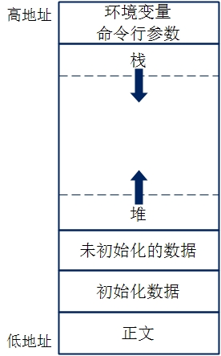
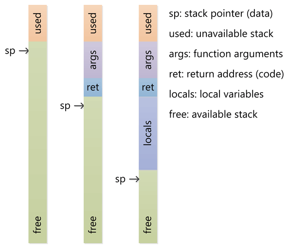

# 计算机基础

## 堆和栈

> 来源：http://stackoverflow.com/questions/79923/what-and-where-are-the-stack-and-heap

### 1. 数据结构的角度

堆栈是两种数据结构。

1. 堆，队列优先，先进先出

2. 栈，先进后出

### 2. 操作系统的角度

* 栈

    由操作系统自动分配释放，存放函数的参数值，局部变量的值等。其操作方式类似于数据结构中的栈。

* 堆

    一般是由程序员分配释放（自动回收），分配方式类似于链表。

### 3. 底层的角度

* 堆

    1. 堆包含一个链表来维护已用和空闲的内存块，在堆上新分配的内存（在c/c++中使用new或者malloc）是从空闲的内存块中找到一些满足要求的合适块。

    2. 堆的申请通常从低地址向高地址扩展（可以把这过程想象成一堆内存块越叠越高）。如果申请的堆空间比较小，操作系统通常会分配大一些的。

    3. 堆容易形成`堆碎片化`。原因是多次申请和释放小内存块可能会导致堆空间产生很多小的空闲内存块，形成碎片，导致无法申请到一个大的内存区域。

    4. 一块被释放的内存块可以和相邻的空闲内存块合并，来形成一块较大的空闲内存区域，从而减少`堆碎片化`。

* 栈

    1. 栈通常和CPU中的`栈指针(stack pointer)`紧密联系。初始状态下，栈指针指向栈顶（栈中的最高地址）

    2. CPU会有push指令和pop指令。push操作会存储当前栈指针的位置（栈指针所指地址减小）。pop操作会取得栈指针所指位置的值，（栈指针所指地址增加）。

    