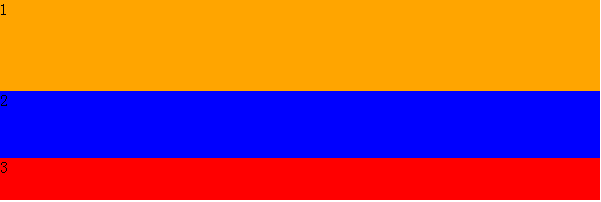

# CSS3基础

## flex布局

> 来源：http://www.warting.com/web/201402/68557.html

### 1. 基本认识

`display:box`是css3新添加的盒子模型属性，它的出现可以解决布局方式。经典的应用场景有：

* 垂直等高

* 水平均分

* 按比例划分

示例html代码

```html
<article>
    <section>1</section>
    <section>2</section>
    <section>3</section>
</article>
```

### 2. box-flex属性（子容器）

1. 作用：主要让子容器针对父容器按一定的规则进行划分

    ```css
    article{
        width:600px;
        height:200px;
        display:-moz-box;
        display:-webkit-box;
        display:box;
    }
    section:nth-child(1){
        background:orange;
        -mox-box-flex:3;
        -webkit-box-flex:3;
        box-flex:3;
    }
    section:nth-child(2){
        background:blue;
        -mox-box-flex:2;
        -webkit-box-flex:2;
        box-flex:2;
    }
    section:nth-child(3){
        background:red;
        -mox-box-flex:1;
        -webkit-box-flex:1;
        box-flex:1;
    }
    ```

    

2. 子容器中的内容如果要居中，只能是在父容器添加`text-align:center`

3. 若有子容器设置了固定宽度，则直接应用设置的宽度值，其他没有设置的则在父容器的宽度基础上减去子容器设置的固定宽度，在剩下的宽度值的基础上按照一定的比例进行分配。

4. 若有子容器设置了间隙，则父容器的宽度会减去间隙值，再按比例分配

### 3. box属性（父容器）

1. box-orient

    用来确定父容器里子容器的排列方式，是水平还是垂直的，可选属性有

    * horizontal：水平排列
    * vertical：垂直排列
    * inline-axis：水平排列
    * block-axis：垂直排列
    * inherit

    1. 当设置了`horizontal`或`inline-axis`时，如果父容器定义了高度值，其子容器的高度值设置则无效，所有子容器的高度等于父容器的高度值；如果父容器不设置高度值，其子容器的高度值才有效且取最大高度值的子容器的高度
    
    2. 当设置了`vertical`或`block-axis`时，如果父容器定义了宽度，其子容器的宽度值设置则无效；如果父容器不设置宽度值，其子容器的宽度值才有效且取最大的子容器的宽度值。

    ```css
    article{
        width:600px;
        height:200px;
        display:-moz-box;
        display:-webkit-box;
        display:box;
        -moz-box-orient:vertical;
        -webkit-box-orient:vertical;
        box-orient:vertical;
    }
    section:nth-child(1){
        background:orange;
        -mox-box-flex:3;
        -webkit-box-flex:3;
        box-flex:3;
    }
    section:nth-child(2){
        background:blue;
        -mox-box-flex:2;
        -webkit-box-flex:2;
        box-flex:2;
    }
    section:nth-child(3){
        background:red;
        -mox-box-flex:1;
        -webkit-box-flex:1;
        box-flex:1;
    }
    ```

    

2. box-direction

    用来确定父容器的子容器排列顺序，可选属性

    * normal
    * reverse
    * inherit

3. box-align

    表示父容器里面子容器垂直对齐方式，可选属性

    * start（居顶对齐）

        

    * end（居底对齐）

        

    * center（居中对齐）

        

    * stretch（拉伸）

        

4. box-pack

    表示父容器里面子容器的水平对齐方式，可选参数

    * start
    * end
    * center
    * justify（支持性暂时不好）
    
    * start（居左对齐）

        

    * end（居右对齐）

        

    * center（居中对齐）

        
