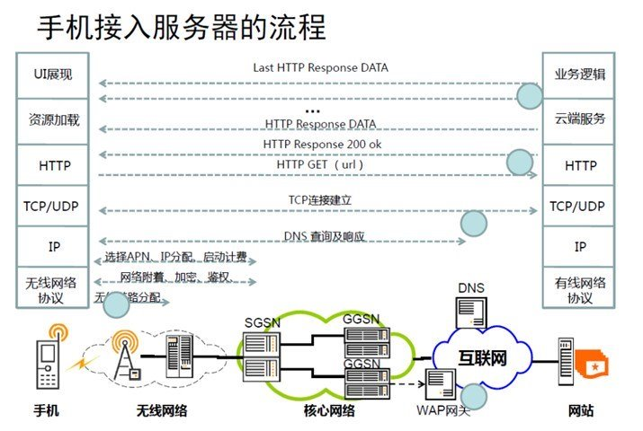

# H5性能优化

> http://ddtalk.github.io/blog/2015/09/07/dingding-first/#rd

## 一秒钟法则

1. 手机要通过无线网络协议，从基站获得无线链路分配，才能跟网络进行通讯。
2. 获取无线链路后，会进行网络附着、加密、鉴权，核心网络会检查手机是否可以连接在这个网络上。
3. 核心网络有SGSN和GGSN，在这一步完成无线网络协议和有线以太网的协议转换
4. 核心网络会对手机进行APN选择，IP分配，启动计费。
5. 传统的网络的步骤

    1. DNS查询，响应
    2. 建立TCP连接
    3. HTTP请求，响应
    4. HTML解析，展现

所谓的一秒钟法则，即达成以下的标准

* 2g网络：1s内完成dns查询，和后台服务器建立连接
* 3g网络：1s内完成首字显示
* wifi网络：1s内完成首屏显示

## 优化方案

### 1. 资源加载

1. 首屏加载

    首屏加载，即在可见的屏幕范围内，内容展示完全，loading进度条消失。

2. 按需加载

    按需加载可以提升首屏加载的速度，但是可能带来更多的界面重绘，影响渲染性能。

3. Lazyload

    原则是让屏幕外，或者不影响整体效果显示的图片、背景等资源，在界面就绪之后再进行网络加载

4. 滚屏加载

    常见的无刷新动态加载数据的方案，通常用在列表形式数据展示中。

5. 响应式加载

    通过这项技术，我们能够方便控制资源的加载与显示。

6. 第三方资源异步加载

    第三方资源有的时候不可控。在使用时要慎重选择，充分考察它们对于性能的影响，使用异步加载的方式进行，防止第三方资源的使用影响到页面本身的功能。

7. loading进度条

    从用户体验的角度来看还是很必要的。

8. 避免30*/40*/50*的http status

    除了200，304这两个的正常的http status，其他的状态码都说明了项目存在着一定的问题。例如301，302中的跳转，等等。

9. Favicon.ico

    保证这个图标的存在，而且尽可能地小，并且设置一个较长的缓存过期时间。

### 2. 图片优化

1. 格式选择

    * webp图片最小，但是在ios或者android4.0以下的系统有兼容性问题。
    * jpg是最常用的格式，大小适中，解码速度快，兼容性问题也基本不存在。
    * png24/png32，显示效果比jpg好，但是人眼很难感知，要避免使用这种格式的大图片

2. 像素控制

    一般建议宽度小于`640px`

3. 小图片合并

    css sprites方案

4. 避免html代码中的大小重设

    需要显示成多大，就下载多大的资源

5. 避免DataURL

    * 好处是可以减少一次http交互的请求，对于体积特别小的图片可以考虑。
    * 缺点是不会被缓存，而且数据体积比二进制图片大1/3

6. 使用图片的替代

    * CSS3和SVG可以更好地适应GPU进行渲染加速，而且会避免增加图片资源导致的http请求增加
    * Iconfont，可以认为是一种矢量类型的操作字体（需要设置特殊的字体）

### 3. 域名/服务端部署

1. Gzip

    服务端开启Gzip压缩

2. 资源缓存，长cache

    对于一些静态的不需要改变的资源，将其缓存过期时间设置的长一些。

3. 分域名部署（静态资源域名）

    将动态资源和静态资源放置在不同的域名下，这样的好处是：静态资源请求时，不会带上动态域名下所设置的cookie头信息，从而减少http请求的大小。

4. 减少cookie

    尽量减少cookie头信息的大小，因为这部分数据使用的是上行流量，上行带宽更小，所以传输速度更慢，因此尽量精简其大小。

5. CDN加速

    优化不同地域接入网站的带宽速度。

### 4. 代码资源

1. js/css合并

    减少资源请求的次数

2. 外联使用js，css

    可以有效地利用缓存

3. 压缩html，js，css

    节约流量

4. 资源版本更新

    业务的js和css可能会有更新，可以使用版本号或者更新时间作为后缀，这样的话，后缀不变，命中缓存；后缀改变，浏览器自动更新最新的代码。

5. css位置

    要放在head标签结束前，这样的话，浏览器会更快地解析出来head中的内容，开始下载css文件资源

6. js位置

    放置底部。

### 5. 代码规范

1. 避免空src

    在某些浏览器可能会导致增加一个无效的http请求

2. 避免css表达式

    可能会让页面多次执行计算，造成卡顿等性能问题

3. 避免空css规则

    降低css渲染计算的成本

4. 避免直接设置元素的style

    不利于缓存和样式的复用

### 6. 服务端接口

1. 接口合并

    减少http请求

2. 减少接口数据量

3. 缓存接口数据

### 7. 其他细节

## 移动端

### 1. 单页应用

### 2. 资源离线

*待续*