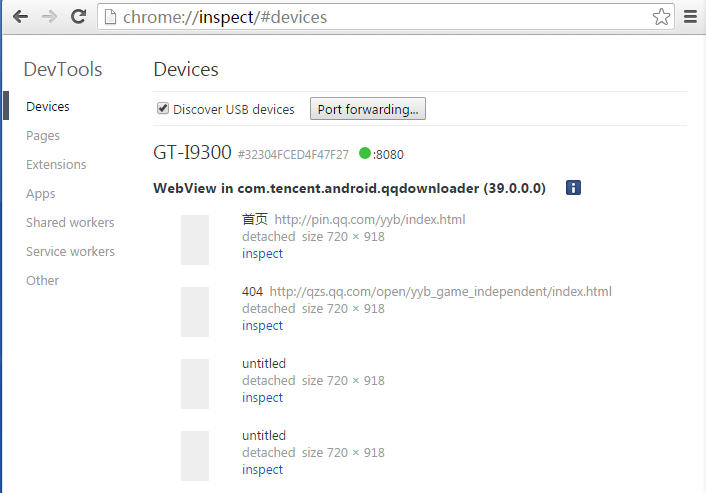

# 移动开发与调试

在移动端调试页面

## 工具

1. fiddler + willow

    * fiddler是一个抓包的工具，而willow是fiddler的一个插件，具体如何安装可以自行google
    * 作用是：在手机端发送一个请求，然后由fiddler抓包，利用willow配置，将请求替换成本地开发中的页面，从而达到开发的目的

2. chrome

    * chrome可以对安卓手机进行远程调试
    * 要求安卓手机可以开启开发者选项，并且允许调试
        ● Android 3.2+，打开设置 – 应用程序 – 开发，在“USB调试”处打钩选上
        ● Android 4.0~ Android 4.1 ，打开设置-开发者选项-进入在“USB调试”处打钩选上。
        ● Android 4.2+，打开设置-关于手机-手机配置信息-连点“版本号”7次，返回上层就可以看到“开发者选项”显示出来了，在“USB调试”处打钩选上

## 流程

1. 让手机连接上电脑的热点（如果是台式机，可以安装无线网卡驱动）
2. 在手机上，对wifi设置代理（长按所连接的网络，然后选择修改网络）
    * 勾上设置代理的选项
    * 输入所连接电脑的IP地址作为主机名（例如：172.27.23.1）
    * 代理服务器端口为fiddler中设置的端口，默认是8888
3. 打开fiddler，在fiddler->tools->Telerik Fiddler Options -> connections ,勾选Allow remote computers to connect
    
4. 在willow中添加project，然后在project中，添加rule，可以替换文件或者替换整个目录，例如有一个上线的项目：myproject.com/mobile/，我们可以设置rule为

    myproject.com/mobile/  -----> d:\workspace\mobile\

    这样访问的页面访问页面myproject.com/mobile/index.html就会被替换成d:\workspace\mobile\indx.html，达到本地开发的目的
5. 手机连上USB，连接电脑，注意要开启调试的权限，这样chrome才能远程调试
6. 打开chrome，在地址栏输入`chrome://inspect/#devices`,然后在手机上访问页面，就可以看到

    

7. 点击inspect，就可以进行调试

    
    
