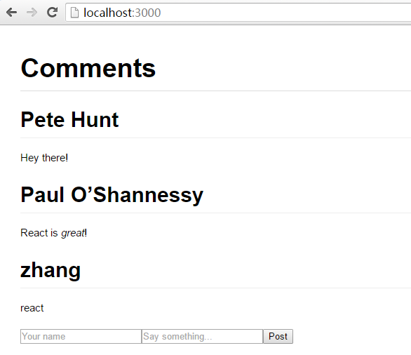
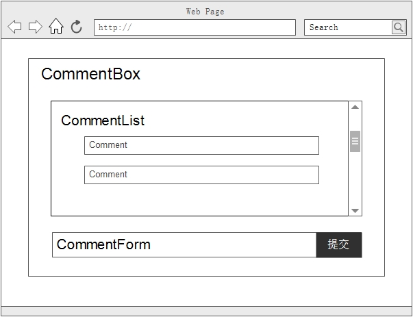

# React-tutorial学习笔记

## 起步

1. 下载[例子](https://github.com/reactjs/react-tutorial)，然后进行解压
2. 由于采用的node环境，因此下载解压之后，只需在所在目录运行

    ```javascript
    npm install
    node server.js
    ```

3. 采用默认端口设置，只需打开浏览器，访问`http://localhost:3000/`

    

## 目录结构说明

*react-tutorial*

    --node_modules
        --body-parser：express中间件，用于接收和解析json数据
        --express：express框架
    --public
        --css
            --base.css：基本样式文件
        --scripts
            -- example.js：React应用js文件
        index.html：基本的HTML结构
    --.editorconfig：用于在不同的编辑器中统一编辑风格（文件编码）的配置文件
    --.gitignore：git相关配置文件
    --app.json：web app的相关信息
    --comments.json：上传的评论数据
    --LICENSE：项目代码使用协议
    --package.json：项目所依赖的包，npm install的安装包的配置文件
    --README.md：项目说明书，里面有使用说明
    --requirements.txt：不清楚
    --server.js：服务器端的js代码

## App功能

此项目构建了一个简单的应用，如图所示


## 服务器端

*服务器端的功能还是相对简单的，通过代码注释的形式来分析*

1. 导入了依赖的模块

    ```javascript
    var fs = require('fs');  //读写文件
    var path = require('path'); //路径
    var express = require('express'); //express框架
    var bodyParser = require('body-parser'); //中间件
    ```

2. 生成app，并且进行配置

    ```javascript
    //获取comments.json文件的路径
    var COMMENTS_FILE = path.join(__dirname, 'comments.json');

    //设置端口
    app.set('port', (process.env.PORT || 3000));

    //设置静态文件的文件目录路径
    app.use('/', express.static(path.join(__dirname, 'public')));
    //启用bodyParser中间件接收请求，并且接收并解析json数据
    app.use(bodyParser.json());
    app.use(bodyParser.urlencoded({extended: true}));
    ```

3. 设置响应头部信息

    ```javascript
    app.use(function(req, res, next) {
        //允许跨域 CORS
        res.setHeader('Access-Control-Allow-Origin', '*');
        //缓存设置
        res.setHeader('Cache-Control', 'no-cache');
        next();
    });
    ```

4. 设置get请求url对应的处理函数（获取评论json数据）

    ```javascript
    app.get('/api/comments', function(req, res) {
        //读取comments.json文件，并且解析为json数据
        fs.readFile(COMMENTS_FILE, function(err, data) {
            if (err) {
              console.error(err);
              process.exit(1);
            }
            //读取成功后，返回
            res.json(JSON.parse(data));
        });
    });
    ```

5. 设置post请求url对应的处理函数（提交评论数据）

    ```javascipt
    app.post('/api/comments', function(req, res) {
        //先读取comments.json文件
        fs.readFile(COMMENTS_FILE, function(err, data) {
            if (err) {
              console.error(err);
              process.exit(1);
            }
            //将文件内容解析为json数据
            var comments = JSON.parse(data);
            //获取新评论
            var newComment = {
              id: Date.now(),
              author: req.body.author,
              text: req.body.text,
            };
            //添加json数组中
            comments.push(newComment);
            //将json数据写回到comments.json文件中
             fs.writeFile(COMMENTS_FILE, JSON.stringify(comments, null, 4), function(err) {
                  if (err) {
                    console.error(err);
                    process.exit(1);
                  }
                  res.json(comments);
            });
        });
    });
    ```

6. 启动，监听端口

    ```javascript
    app.listen(app.get('port'), function() {
      console.log('Server started: http://localhost:' + app.get('port') + '/');
    });
    ```

## web端

web端核心在于`example.js`文件，结合官网的资料，我们对这个应用进行分析，学习如何构建一个简单的react应用。

### 组件结构

React践行了`Web Components`的理念，依照组件化的开发方式，我们来分析这个应用的组件结构（如图所示）：



即是：

    - CommentBox
        - CommentList
            - Comment
        - CommentForm

#### Comment

如上述的结构图，我们从最底层开始编写组件


